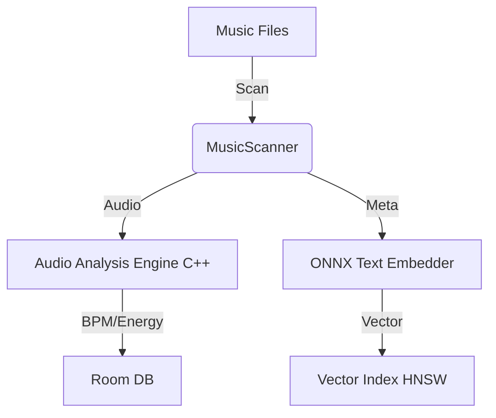
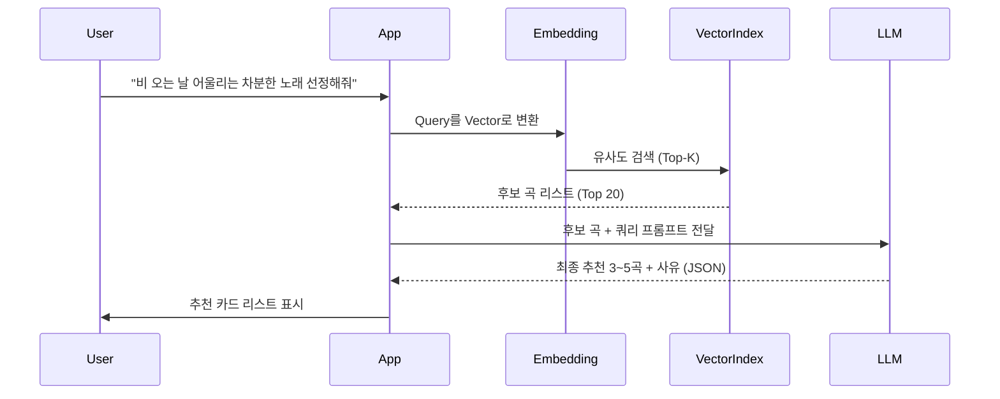

# 🎵 MusicRAG: On-Device Music Recommendation System


**MusicRAG**는 인터넷 연결 없이 10,000곡 이상의 로컬 음악 파일을 분석하여, 사용자 질문에 맞춰 지능적으로 음악을 추천하는 안드로이드 애플리케이션입니다. 온디바이스(On-Device) LLM과 벡터 검색(RAG)을 결합하여 개인화되고 안전한 음악 추천 경험을 제공합니다.

---

## ✨ 핵심 기능 (Key Features)

- **🚀 온디바이스 RAG 아키텍처:** 모든 데이터 분석 및 추론이 기기 내에서 로컬로 수행됩니다 (Privacy First).
- **🧠 지능형 추천 (LLM):** Qwen2.5-3B 모델을 브레인으로 사용하여 복잡한 사용자 쿼리를 이해하고 맞춤형 추천 사유를 생성합니다.
- **🔍 듀얼 검색 시스템:**
  - **Vector Search:** `all-MiniLM-L6-v2`를 이용한 의미 검색(Semantic Search).
  - **BPM Search:** 사용자의 요구사항에 맞는 정확한 템포(BPM) 기반 검색.
- **🎼 멀티모달 오디오 분석:** 제목과 가수 정보뿐만 아니라 실제 오디오 데이터를 분석하여 BPM, Energy 등의 피처를 추출합니다.
- **🔋 백그라운드 인덱싱:** WorkManager를 활용하여 기기 유휴 시간(충전 중)에 대용량 라이브러리를 효율적으로 인덱싱합니다.

---

## 🛠 기술 스택 (Tech Stack)

| 구분 | 기술 |
| :--- | :--- |
| **Mobile** | Kotlin, Jetpack Compose, Room (SQLite), Hilt, Coroutines |
| **LLM Engine** | `llama.cpp` (v4.0+), GGUF Model (Qwen2.5-3B) |
| **Embedding** | `ONNX Runtime`, `all-MiniLM-L6-v2` |
| **Vector Search** | Hierarchical Navigable Small World (HNSW) / Flat Index (C++ JNI) |
| **Audio Analysis** | `aubio` (NDK), Custom C++ Audio DSP |
| **Native** | CMake, JNI (C++ 17) |

---

## 🏗 시스템 아키텍처 (Architecture)

### 데이터 파이프라인 (Data Pipeline)



### 추천 워크플로우 (Inference Flow)



---

## 🚀 시작하기 (Getting Started)

### 사전 요구 사항
- Android Studio Ladybug 이상
- Android SDK 33+ / NDK 25+
- MTK 8395 또는 그에 준하는 성능의 기기 (최소 8GB RAM 권장)

### 모델 준비
본 저장소에는 모델 파일이 포함되어 있지 않습니다. 다음 모델들을 다운로드하여 `app/src/main/assets/` 또는 지정된 경로에 배치해야 합니다.
1. **LLM:** [Qwen2.5-3B-Instruct-GGUF](https://huggingface.co/Qwen/Qwen2.5-3B-Instruct-GGUF) (q4_k_m 권장)
2. **Embedding:** `all-MiniLM-L6-v2.onnx`

### 빌드 및 실행
```bash
./gradlew assembleDebug
```

---

## 🎨 디자인 컨셉
- **"Deep Resonance" (깊은 울림):** 오디오 파형(Waveform)과 네온/글로우 효과를 활용한 다크 모드 전용 UI.
- **Intelligent Interaction:** AI 추론 및 인덱싱 시 생동감 넘치는 파동 애니메이션 제공.

---

## 📄 라이선스 (License)

이 프로젝트는 **GNU Affero General Public License v3.0 (AGPL-3.0)**에 따라 라이선스가 부여됩니다. 자세한 내용은 [LICENSE](LICENSE) 파일을 참조하십시오.

---

## 🤝 기여하기
버그 리포트나 기능 제안은 Issue를 통해 남겨주세요. 모든 기여를 환영합니다!

---
*Developed with ❤️ by High-End On-Device AI Team*
